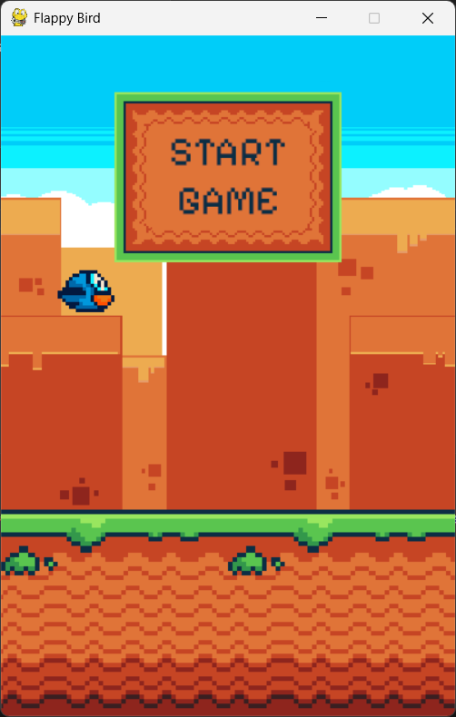

# 🐤 Flappy Bird Clone

A simple and fun **Flappy Bird clone** built with **Python** and **Pygame**.  
I created this project just for fun and to reinforce my understanding of Python game development using the Pygame library.

🛠️ Built With

    Language: Python

    Library: Pygame

    IDE: Visual Studio Code
  

🚀 How to Run

Clone the repository
    git clone https://github.com/QRick0/FlappyBird.git
    cd flappy-bird-clone

Install dependencies
Make sure you have Python installed, then install Pygame with:

    pip install pygame

Run the game
The main file to run is main.py:

    python main.py

📁 Project Structure

    FlappyBird/
    ├── Fonts/           # Fonts
    ├── Graphics/        # Images
    ├── Sounds/          # Sounds
    ├── main.py          # Main game loop
    ├── README.md        # This file
    └── ...              # Additional modules

🎯 Features

    Tap-to-flap gameplay just like the original Flappy Bird

    Moving pipe obstacles

    Score counter

    Retro-style look

📚 What I Learned

This project helped me practice:

    Writing game logic in Python

    Using Pygame to manage the game loop, collisions, and rendering

    Working with sprite movement and gravity

    Creating a playable and interactive experience

    Organizing a small game project

📸 Screenshots

💡 Future Improvements

Some things I’d like to add in the future:

    High score saving and death screen

    Better art or animations

🤝 Contributing

This was made as a personal learning project, but feel free to fork it, use it, or build on it!

📜 License

No license has been added yet — feel free to use this code for learning or experimenting.

I used these assets

https://megacrash.itch.io/flappy-bird-assets

Thanks for checking out my project!
Feel free to ⭐ it or fork it if you found it helpful or fun! 🐦✨
